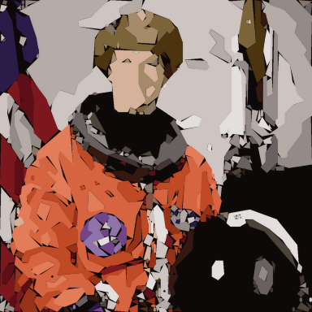
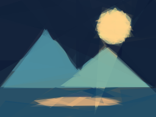
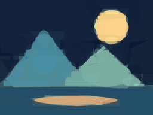

# ShapeGrad

Reconstruct images from overlapping triangles, rectangles, and ellipses. Residual-guided search optimizes each added primitive; a supervised tree model learns to rank proposals. Compare geometric optimizers in a local UI and export editable SVG artwork.

## Run locally

```sh
python -m venv .venv
# Windows: .venv\Scripts\activate
# macOS/Linux: source .venv/bin/activate
pip install -r requirements.txt
python -m streamlit run app.py
```

Open http://localhost:8501. **Residual-guided search** is the default. It builds the image one simple shape at a time, without tracing image boundaries. Upload a picture or select the built-in landscape or portrait. Download SVG, PNG, GIF, and metrics. The table reports pixel MSE, structural similarity (SSIM), time, and SVG size from the fitted scene geometry. The site runs locally; no hosted deployment is configured.

Train the optional supervised proposal ranker before selecting it or the three-method comparison:

```sh
python learn_proposals.py --benchmark
```

The locally trained model and dataset are ignored by Git. Training regenerates them in `models/`; the model card is included in the repository. Train before selecting learned mode. The UI loads only the project's local model artifact.

## Sharper gradient reconstruction

Adam still optimizes simple shapes, without tracing. Its training edges progressively sharpen from 40 to 160 in renderer units; checkpoint losses are evaluated at the fixed final sharpness so changing edge width cannot falsely improve the history. Disable sharpening in **Gradient appearance** for the fixed-width baseline. The opacity floor controls how transparent shapes may become (studio default 0.15); higher floors can reduce haze but can also obscure useful layers. Transparency alone does not determine sharpness.

Completed previews and PNG exports use antialiased vector geometry, while live gradient previews show the differentiable renderer. The studio includes side-by-side source/output, measured quality and runtime, and an absolute-error view. These changes address rendering softness; random initialization and limited shape budgets can still lose detail. No general quality improvement is claimed without matched benchmarks.

## Archived contour tracing experiment (CLI only)

This separate experiment traces color regions. It is excluded from the studio because its traced silhouettes do not match the intended simple-shape aesthetic:

1. Fit a MiniBatchKMeans color palette in CIE Lab space. Merge nearly identical centers to avoid splitting flat colors into artificial fragments.
2. Clean isolated label noise with a categorical majority filter, then find connected components and trace their boundaries.
3. Simplify those boundaries into closed polygons. Compound SVG paths preserve disconnected details and holes for each palette color, rather than discarding small regions to meet a layer budget.
4. Jointly optimize palette colors, background, and a shared smooth deformation field using PyTorch autograd. The shared field moves common boundary locations consistently rather than moving neighboring shapes independently.
5. Use pixel, edge, differentiable SSIM, and deformation-smoothness losses. Accept a refinement checkpoint only if the re-rendered vector scene has lower MSE and no lower SSIM than the currently accepted scene.

The contour experiment settings are a 24-color palette budget, up to 128 foreground layers, 256-pixel fitting resolution, and 80 refinement steps. Similar colors can merge, so the actual layer count is often smaller. Compound paths can have many vertices: layer count alone is not a complexity measure. The field moves boundaries by up to two fitting pixels and densifies long edges when exporting a nonlinear deformation. Final PNGs are rendered at a 1,024-pixel longest side.

The palette fit is unsupervised ML. Joint refinement is per-image differentiable optimization, not a pretrained generative network. The supervised proposal ranker remains a separate comparison method. No pretrained perceptual network or text-to-image model is included.

```sh
python contour_model.py photo.jpg --palette 32 --layers 128 --steps 80 --size 256
python contour_benchmark.py
```

Increase the palette budget for more tonal detail. Increase fitting resolution to retain smaller features. Flat fills still simplify textures, and the majority filter can remove very small details. Boundaries are polygonal; Bezier curves are not implemented yet.

### Initial quality comparison

Two examples at 128-pixel fitting resolution; contour mode uses a 24-color palette and 40 refinement steps. Search uses 128 shape additions, 48 candidates, 40 mutations per shape, and one search start. These are different representations and compute budgets, not an equal-complexity benchmark.

| Image / method | Pixel MSE ↓ | SSIM ↑ | Seconds | SVG bytes |
| --- | ---: | ---: | ---: | ---: |
| Landscape, geometric search | 0.001197 | 0.919 | 4.00 | 13,605 |
| Landscape, contour refinement | 0.001101 | 0.952 | 2.41 | 3,490 |
| Portrait, geometric search | 0.013846 | 0.535 | 6.19 | 13,692 |
| Portrait, contour initialization | 0.011230 | 0.661 | 0.42 | 53,457 |
| Portrait, contour refinement | 0.011230 | 0.661 | 1.95 | 53,457 |

The portrait's refinements were rejected by the quality guard, so its initialized scene was retained. It reduces MSE about 19% versus this search baseline and improves SSIM, but uses substantially more contour vertices and a larger SVG. Landscape refinement improves both metrics with a smaller SVG. This is a two-example demonstration, not evidence of general superiority over Primitive or all photographs.

Raw metrics, initializer/refiner ablations, outputs, and settings: [contour benchmark](benchmarks/contours/results.json).



The portrait source is NASA's photograph of Eileen Collins, provided by `skimage.data.astronaut`, which is [documented as public domain](https://scikit-image.org/docs/stable/api/skimage.data.html#skimage.data.astronaut). All other example artwork is generated locally.

## Residual-guided primitive reconstruction

1. Start with the image's mean color.
2. Sample triangle, rectangle, and ellipse candidates near pixels with large residual errors.
3. Solve each candidate's RGB color analytically under alpha compositing, rather than randomly searching color.
4. Refine the strongest candidate with progressively smaller geometric mutations.
5. Recheck the candidate with supersampled antialiasing and commit it only if MSE improves.
6. Repeat, freezing accepted shapes. Final previews display SVG directly, and PNG exports re-render the geometry at a 1,024-pixel longest side. GIFs retain the fitting resolution. Raster previews and SVG use the same geometry and layer order, though rasterizer boundary conventions can differ slightly.

The geometric UI settings use 128 shape additions, four independent search starts per shape, 256 candidates and 96 refinement attempts per start, and 256-pixel fitting resolution. The function defaults stay smaller for quick scripted experiments. Search starts are refined independently, then their winners are compared with antialiasing. Coordinate-wise mutations allow precise edge adjustments. More detailed photographs may need 256 shapes and larger budgets. This remains an approximation; tiny text and fine textures are difficult.

The optional **Coherent triangle style** uses triangles only, fixed opacity of 128/255, and a minimum triangle angle of 15 degrees. It avoids thin slivers and mixed-shape silhouettes. It applies to the three sequential methods and is a visual style experiment, not a guarantee of lower pixel error. Pixel MSE does not directly measure edge continuity or perceptual coherence.


See [editable output](examples/improved.svg) and [example metrics](examples/improved-metrics.json). The earlier ellipse-only [preview](examples/result.png) remains for comparison. The example is original synthetic artwork, not a photo benchmark.

## Why Primitive still has a stronger search

The [original search code](https://github.com/fogleman/primitive/blob/master/primitive/model.go) requests 1,000 random candidates per search start, an age setting of 100 for hill climbing, and at least 16 starts distributed across workers. Its age setting is a stopping criterion, not a fixed count of 100 mutations. That is at least 16,000 initial candidate evaluations per added shape, before refinement. Our new UI defaults use 1,024 initial candidates per shape plus refinement; the previous defaults used 384. We still have a much smaller budget and one search worker. Primitive uses parallel workers and specialized scanline loops.

The [original CLI](https://github.com/fogleman/primitive/blob/master/main.go) fits at 256 pixels and renders at 1,024 pixels. We now separate fitting from output resolution too. Larger output makes boundaries sharp; more search and more shapes are what improve reconstruction detail. More Adam iterations do not substitute for candidate search in the sequential methods.

Run `python quality_ablation.py` to isolate search-budget and shape-count effects on the bundled target. Outputs and metrics are in `benchmarks/quality/`. This is one image and one seed, not an external Primitive benchmark.

| Setting | Shapes | Candidates / start | Refinements / start | Starts | Final MSE |
| --- | ---: | ---: | ---: | ---: | ---: |
| Small search | 64 | 48 | 40 | 1 | 0.002712 |
| Deeper search | 64 | 128 | 96 | 3 | 0.001030 |
| Deeper search + more shapes | 128 | 128 | 96 | 3 | 0.000375 |

Deeper search reduced error 62% at fixed shape count; doubling the shapes reduced it 86% relative to small search. Fitting took about 7, 66, and 122 seconds respectively, with other local checks running concurrently. Use the JSON for exact settings and timings. These are pixel-error improvements, not perceptual ratings.


## Execution optimization with unchanged search results

The sequential methods now cache the residual sampling distribution, existing canvas error, and 12-pixel feature images per shape addition. Candidate arithmetic is restricted to the exact nonzero raster bounds, using reusable buffers. Full-image reduction order is deliberately retained: changing floating-point sums changed tie-breaking in an earlier experiment. Every committed shape is still checked with the original full-resolution antialiased scorer.

`reconstruct(..., backend='reference')` runs the original dense scorer. `backend='cached'` isolates caching, and `backend='regional'` is the default optimized implementation. The number of candidates and refinements is unchanged across these backends; there is no resolution reduction or skipped scoring.

| Workload | Reference mean seconds | Regional mean seconds | Speedup |
| --- | ---: | ---: | ---: |
| Search: 3 synthetic images, 2 seeds, 16 shapes at 192 pixels | 6.93 | 2.44 | 2.83x |
| Learned ranking: 3 synthetic images, 8 shapes at 192 pixels | 2.39 | 0.97 | 2.45x |

All nine regional runs reproduced the reference rendered pixels exactly, with identical losses and evaluation counts in the tested environment. This is tested equivalence, not a cross-platform bitwise guarantee. The UI now spends some of the saved time on more search: four starts with 256 candidates instead of three starts with 128. Default UI wall time is not the same-budget benchmark above.

Run `python speed_benchmark.py`; raw measurements are in [speed results](benchmarks/speed/results.json). Timings exclude final PNG rendering. The CPU search is still single-worker; this optimization does not claim a GPU or multicore implementation.

## Direct comparison with the original

We built and ran the original `fogleman/primitive` executable against the bundled landscape with 64 shapes, a 128-pixel fitting size, and a 256-pixel output. Primitive used two workers and fixed opacity; ShapeGrad used one worker, seed 7, and variable opacity. Candidate budgets and rasterizers differ.

| Method | Candidate evaluations | Seconds | Output MSE |
| --- | ---: | ---: | ---: |
| Original Primitive, triangles | 1,272,300 | 6.09 | 0.003912 |
| Original Primitive, mixed types | 1,224,609 | 11.00 | 0.002402 |
| ShapeGrad, mixed types | 43,200 | 26.97 | 0.002359 |
| ShapeGrad, triangles | 43,200 | 24.32 | 0.002483 |

This is a single unseeded upstream run, not a general performance ranking. Even after the regional optimization, the Go implementation evaluated roughly 28–29 times as many candidates and was faster. Its triangle-only image looks more cohesive; its [triangle implementation](https://github.com/fogleman/primitive/blob/master/primitive/triangle.go) rejects angles below 15 degrees. ShapeGrad's similar or lower MSE here does not imply better aesthetics.




Run `go install github.com/fogleman/primitive@latest`, then `python compare_primitive.py` on Windows. The script records the installed upstream build/dependencies, commands, outputs, and counts in [comparison results](benchmarks/primitive/results.json). Upstream code is not bundled. Comparison timings were recorded with some local validation running concurrently, so treat them as indicative, not isolated machine benchmarks.

## The ML component

An `ExtraTreesRegressor` predicts a candidate's full-resolution MSE improvement from twelve features: shape identity, size, coverage, opacity, coarse residual statistics, color variation, and gain measured on a 12?12 proxy image. This is supervised learning of a proposal-value surrogate, not a pretrained generative image model.

The learned method predicts scores for a pool four times larger than the baseline, then fully evaluates only the highest-ranked candidates. Acceptance still requires measured improvement; model predictions alone cannot make the output worse at an individual accepted step.

Training generates 6,100 labeled proposals from 24 synthetic images, over eight intermediate canvas states per image. Validation uses six disjoint image seeds and 1,524 proposals. Entire images are kept separate to avoid proposal-level leakage. Benchmark images use a third disjoint seed range.

The current model achieves **R? = 0.790** and **MAE = 0.000303** on held-out proposal gains. These evaluate gain prediction, not final image aesthetics. The coarse gain feature accounts for about 83% of tree impurity importance; the heuristic ablation is therefore essential.

## Initial benchmark

Three unseen synthetic images ? two search seeds; 32 shape additions, 12 exact candidate evaluations and 12 refinement evaluations per shape, 96-pixel images. Ranking methods get the same full-resolution scoring budget as baseline, but consider four times as many candidates through proxy features.

| Method | Mean final MSE ? | Mean seconds ? |
| --- | ---: | ---: |
| Residual-guided baseline | 0.02043 | 1.08 |
| Coarse gain heuristic, no training | 0.01587 | 2.72 |
| Learned Extra Trees ranking | 0.01611 | 2.83 |

The learned method reduces mean MSE by **21.2% versus baseline**, has **1.5% higher error than the coarse heuristic**, and takes about **2.6x baseline time**. There is no demonstrated speedup. Timings include feature extraction and inference and depend on the machine. This small synthetic benchmark provides no evidence yet of generalization to photographs or statistical significance.

Raw runs and timing details: [benchmark JSON](benchmarks/results.json). Training setup, split seeds, validation metrics, and feature importance: [model card](models/model_card.json).

## Original gradient experiment

`shapegrad.py` retains the initial differentiable ellipse renderer, Adam optimization, and legacy global hill climbing / simulated annealing for educational comparison:

```sh
python shapegrad.py photo.jpg --method adam --shapes 128 --steps 1000 --size 192 --gif
```

All optimizers now support mixed triangles, rectangles, and ellipses, or a single family selected with `--shape-family`. Triangle vertices, rectangle geometry, colors, and opacity are differentiable. Shape identity is fixed during each global fit. Its pixel-plus-edge objective differs from the new renderer's pixel MSE, so the loss values are not directly comparable. Its optimization renderer still has soft boundaries and its global random search needs far more iterations than sequential search; it is not the recommended quality mode. Final UI exports use hard vector geometry, so their boundary pixels differ from the soft optimization preview.

## Validation and next work

```sh
python -m unittest discover -s tests -v
```

Tests check contour holes, shared boundary transforms, differentiable SSIM against the reference metric, accepted export quality, uniform inputs, seeded segmentation, optimal color solving, monotonic accepted error, raster consistency, SVG structure, learned-ranking integration, finite datasets, legacy optimizer behavior, and a full UI generation/export run.

Next experiments: train and evaluate on a licensed photo corpus, cache coarse features, compare under equal wall-clock budgets, add confidence intervals across more images/seeds, and test neural proposal prediction. Perceptual features or semantic importance masks could prioritize subjects, but are not implemented.

A defensible resume description: "Built an image-to-vector studio combining unsupervised color clustering, contour extraction, joint PyTorch refinement, and a supervised tree proposal ranker; evaluated quality, runtime, and SVG complexity with ablations and image-disjoint validation." Include the measured quality/runtime tradeoff rather than claiming generative-model training or acceleration.

## Inspiration and license

[Primitive](https://github.com/fogleman/primitive) inspired sequential shape search. [DiffVG](https://github.com/BachiLi/diffvg) provides related differentiable-vector research. This repository contains an original implementation; neither project's code is bundled. The underlying techniques are established, not claimed as novel research.

MIT. Synthetic examples are generated locally using Pillow.
