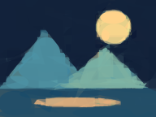
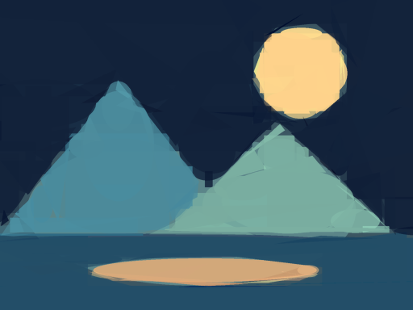

# ShapeGrad

Image-to-SVG reconstruction with residual-guided geometric search and a learned tree model for ranking shape proposals. Includes a local experiment UI, reproducible training pipeline, and held-out benchmark with a non-ML ablation.

## Run locally

```sh
python -m venv .venv
# Windows: .venv\Scripts\activate
# macOS/Linux: source .venv/bin/activate
pip install -r requirements.txt
python learn_proposals.py --benchmark
python -m streamlit run app.py
```

Open http://localhost:8501. Upload an image or try the example. **Residual-guided search** is the default. Compare it with **Learned tree proposal ranker** and **Coarse heuristic (no ML)**. Download SVG, PNG, GIF, and metrics. The site runs locally; no hosted deployment is configured.

The locally trained model and dataset are ignored by Git. Training regenerates them in `models/`; the model card is included in the repository. Train before selecting learned mode. The UI loads only the project's local model artifact.

## How reconstruction works

1. Start with the image's mean color.
2. Sample triangle, rectangle, and ellipse candidates near pixels with large residual errors.
3. Solve each candidate's RGB color analytically under alpha compositing, rather than randomly searching color.
4. Refine the strongest candidate with progressively smaller geometric mutations.
5. Recheck the candidate with supersampled antialiasing and commit it only if MSE improves.
6. Repeat, freezing accepted shapes. Final previews display SVG directly, and PNG exports re-render the geometry at a 1,024-pixel longest side. GIFs retain the fitting resolution. Raster previews and SVG use the same geometry and layer order, though rasterizer boundary conventions can differ slightly.

The UI default uses 128 shape additions, three independent search starts per shape, 128 candidates and 96 refinement attempts per start, and 256-pixel fitting resolution. The function defaults stay smaller for quick scripted experiments. Search starts are refined independently, then their winners are compared with antialiasing. Coordinate-wise mutations allow precise edge adjustments. More detailed photographs may need 256 shapes and larger budgets. This remains an approximation; tiny text and fine textures are difficult.



See [editable output](examples/improved.svg) and [example metrics](examples/improved-metrics.json). The earlier ellipse-only [preview](examples/result.png) remains for comparison. The example is original synthetic artwork, not a photo benchmark.

## Why Primitive still has a stronger search

The [original search code](https://github.com/fogleman/primitive/blob/master/primitive/model.go) requests 1,000 random candidates per search start, an age setting of 100 for hill climbing, and at least 16 starts distributed across workers. Its age setting is a stopping criterion, not a fixed count of 100 mutations. That is at least 16,000 initial candidate evaluations per added shape, before refinement. Our new UI defaults use 384 initial candidates per shape plus refinement, so they remain much cheaper.

The [original CLI](https://github.com/fogleman/primitive/blob/master/main.go) fits at 256 pixels and renders at 1,024 pixels. We now separate fitting from output resolution too. Larger output makes boundaries sharp; more search and more shapes are what improve reconstruction detail. More Adam iterations do not substitute for candidate search in the sequential methods.

Run `python quality_ablation.py` to isolate search-budget and shape-count effects on the bundled target. Outputs and metrics are in `benchmarks/quality/`. This is one image and one seed, not an external Primitive benchmark.

| Setting | Shapes | Candidates / start | Refinements / start | Starts | Final MSE |
| --- | ---: | ---: | ---: | ---: | ---: |
| Small search | 64 | 48 | 40 | 1 | 0.002712 |
| Deeper search | 64 | 128 | 96 | 3 | 0.001030 |
| Deeper search + more shapes | 128 | 128 | 96 | 3 | 0.000375 |

Deeper search reduced error 62% at fixed shape count; doubling the shapes reduced it 86% relative to small search. Fitting took about 7, 66, and 122 seconds respectively, with other local checks running concurrently. Use the JSON for exact settings and timings. These are pixel-error improvements, not perceptual ratings.



## The ML component

An `ExtraTreesRegressor` predicts a candidate's full-resolution MSE improvement from twelve features: shape identity, size, coverage, opacity, coarse residual statistics, color variation, and gain measured on a 12?12 proxy image. This is supervised learning of a proposal-value surrogate, not a pretrained generative image model.

The learned method predicts scores for a pool four times larger than the baseline, then fully evaluates only the highest-ranked candidates. Acceptance still requires measured improvement; model predictions alone cannot make the output worse at an individual accepted step.

Training generates 6,100 labeled proposals from 24 synthetic images, over eight intermediate canvas states per image. Validation uses six disjoint image seeds and 1,524 proposals. Entire images are kept separate to avoid proposal-level leakage. Benchmark images use a third disjoint seed range.

The current model achieves **R? = 0.790** and **MAE = 0.000303** on held-out proposal gains. These evaluate gain prediction, not final image aesthetics. The coarse gain feature accounts for about 83% of tree impurity importance; the heuristic ablation is therefore essential.

## Initial benchmark

Three unseen synthetic images ? two search seeds; 32 shape additions, 12 exact candidate evaluations and 12 refinement evaluations per shape, 96-pixel images. Ranking methods get the same full-resolution scoring budget as baseline, but consider four times as many candidates through proxy features.

| Method | Mean final MSE ? | Mean seconds ? |
| --- | ---: | ---: |
| Residual-guided baseline | 0.02043 | 1.08 |
| Coarse gain heuristic, no training | 0.01587 | 2.72 |
| Learned Extra Trees ranking | 0.01611 | 2.83 |

The learned method reduces mean MSE by **21.2% versus baseline**, has **1.5% higher error than the coarse heuristic**, and takes about **2.6x baseline time**. There is no demonstrated speedup. Timings include feature extraction and inference and depend on the machine. This small synthetic benchmark provides no evidence yet of generalization to photographs or statistical significance.

Raw runs and timing details: [benchmark JSON](benchmarks/results.json). Training setup, split seeds, validation metrics, and feature importance: [model card](models/model_card.json).

## Original gradient experiment

`shapegrad.py` retains the initial differentiable ellipse renderer, Adam optimization, and legacy global hill climbing / simulated annealing for educational comparison:

```sh
python shapegrad.py photo.jpg --method adam --shapes 128 --steps 1000 --size 192 --gif
```

All optimizers now support mixed triangles, rectangles, and ellipses, or a single family selected with `--shape-family`. Triangle vertices, rectangle geometry, colors, and opacity are differentiable. Shape identity is fixed during each global fit. Its pixel-plus-edge objective differs from the new renderer's pixel MSE, so the loss values are not directly comparable. Its optimization renderer still has soft boundaries and its global random search needs far more iterations than sequential search; it is not the recommended quality mode. Final UI exports use hard vector geometry, so their boundary pixels differ from the soft optimization preview.

## Validation and next work

```sh
python -m unittest discover -s tests -v
```

Tests check optimal color solving, monotonic accepted error, raster consistency, SVG structure, learned-ranking integration, finite datasets, legacy optimizer behavior, and a full UI generation/export run.

Next experiments: train and evaluate on a licensed photo corpus, cache coarse features, compare under equal wall-clock budgets, add confidence intervals across more images/seeds, and test neural proposal prediction. Perceptual features or semantic importance masks could prioritize subjects, but are not implemented.

A defensible resume description: ?Built an image-to-vector reconstruction system with analytical color fitting, residual-guided search, and an Extra Trees proposal-ranking surrogate; evaluated against search and non-ML heuristic baselines using image-disjoint splits.? Include the measured quality/runtime tradeoff rather than claiming generative-model training or acceleration.

## Inspiration and license

[Primitive](https://github.com/fogleman/primitive) inspired sequential shape search. [DiffVG](https://github.com/BachiLi/diffvg) provides related differentiable-vector research. This repository contains an original implementation; neither project's code is bundled. The underlying techniques are established, not claimed as novel research.

MIT. Synthetic examples are generated locally using Pillow.
